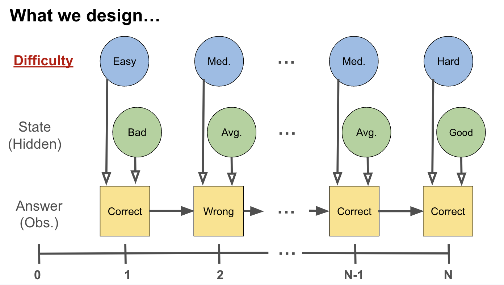

# hmm-kit
A fast HMM toolkit package designed for estimation and analysis of Hidden Markov Model (HMM) with extra dimension of data.

This toolkit allows you to:
- Estimate the parameters of a Hidden Markov Model (HMM) using the Baum-Welch algorithm.
- Decode the model using the Viterbi algorithm.
- Accommodate for covariates of the observations in the model.


## Usage

### HMM Estimation

```python
# from hmm_kit.core import base       # this module contains the base classes for the HMM
from hmm_kit.core import covariates   # this module contains the classes for the covariate HMM

# # base case (w/o covariate)
# estimation = base.baum_welch(
#     data_list, n_hiddens=3, n_outcomes=2
# )

# w/ covariate case
estimation = covariates.baum_welch_with_covariates(
    data_list, covariates_list, n_hiddens=3, n_outcomes=2
)
```

## Use Case
- The original design is to fit a Hidden Markov Model (HMM) to a sequence of observations and the covariates of the observations, difficulties.

- See the example sequence process of covariate HMM

    
